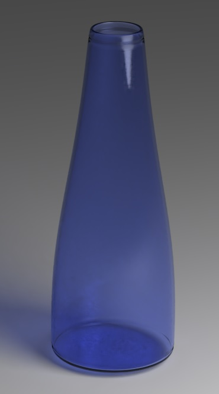
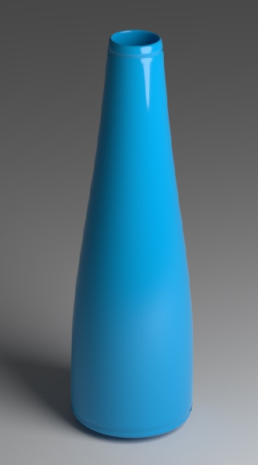

## Stránky se studijními materiály, články a odkazy na jednom místě

Tyto stránky slouží nejenom jako **studijní materiál**, ale i jako "uzel" pro výměnu informací v předmětech informatika a počítačová grafika ve všech ročnících.

### Informatika 5. ročník

Pro učení se základům programování nám slouží program Scratch, který si můžete stáhnout bezplatně na [domovských stránkách programu Scratch](https://scratch.mit.edu/download).

**Již máme probráno**:    
1. základní příkazy pro spuštění programu a pohyb avatara
2. editace avatara a pozadí
3. smyčky a jejich aplikace
4. skupinu příkazů pero a zvuky

Příklad jednoduchého programu na použití smyčky si můžete [stáhnout zde.](Dvojité salto.sb) (Jakékoliv návrhy na jeho vylepšení budou vítány)

### Informatika 6. ročník

Pokračujeme v zásadách správného prezentování. Výčet těch nejzákladnějších:

1. Představení se a krátký úvod k obsahu prezentace
2. Oční kontakt s posluchači
3. Mluvíme nahlas a zřetelně
4. Prezentaci nečteme doslovně z tabule
5. Pro lepší názornost můžeme použít ukazovátko
6. Poděkujeme za pozornost

**Tyto zásady neuplatňujeme pouze v informatice, ale i kdekoliv jinde.**

### Informatika 7. ročník

Prohlubování dosavadních dovedností v programu MS Excel. 

Správné řešení úkolu z minulé hodiny je [dostupné zde.](Statistické funkce.xlsx)

### Zeměpis 6. ročník

Zaměřujeme se především na práci s atlasem a získávání podstatných informací z tematických map. Studijní materiál týkající se čtení vrstevnic je [dostupný zde.](Určování nadmořské výšky pomocí vrstevnic.pdf)

Zájemci o problematiku grafů nevynechají [článek zabývající se manipulací a zkreslováním dat](https://www.idnes.cz/technet/veda/manipulace-grafy-statistika.A151023_164547_veda_pka). Dobrovolník si na toto téma může připravit referát. (po předchozí domluvě)

### Počítačová grafika 7. ročník

Program Inkscape si můžete bezplatně [stáhnout zde.](https://inkscape.org/release/inkscape-0.92.4/windows/64-bit/exe/dl/)
Jako návod a zdroj inspirace nám pak slouží stránky [AbcLinuxu.cz](https://www.abclinuxu.cz/serialy/inkscape)

Dokončujeme vektorovou grafiku, reprezentovanou programem Inkscape.

### Počítačová grafika 9. ročník

Program Blender si můžete bezplatně [stáhnout zde.](https://www.blender.org/download/)
Oficiální manuál [najdete zde.](https://docs.blender.org/manual/en/latest/index.html)

Ukázky modelování jednoduché vázy při použití dodatečných modifikátorů. (Subdivision surface) 
Na této úrovni už bychom měli být všichni. (cycles render, 200 samples, denoising enabled)

Vlevo materiál sklo, vpravo Principled BSDF.

 
