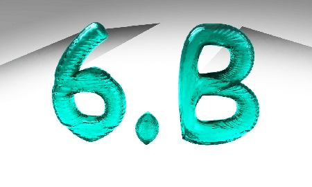

## Stránky se studijními materiály, články a odkazy na jednom místě

Tyto stránky slouží nejenom jako **studijní materiál**, ale i jako "uzel" pro výměnu informací v předmětech informatika a počítačová grafika ve všech ročnících.

### Informatika 5. ročník

## MS Word 2010

Jako studijní materiál nám pro začátek postačí webový manuál na stránkách [fotopulos.net](http://word-navod.fotopulos.net/word-2010/zaklad.html#z1).

**Již máme probráno**:
1.  orientuji se v uživatelském prostředí programu
2.  píši spisovné české věty
3.  vkládám obrázky, automatické tvary a kliparty
4.  umím základní formátování textu (nadpis, velikost a barva písma, motivy písma, tučné, kurzíva, podtržení)
5.  zarovnávám text
6.  pracuji s odrážkami v textu

Již zvládáme základní orientaci v uživatelském prostředí programu

Pro učení se základům programování nám slouží program Scratch, který si můžete stáhnout bezplatně na [domovských stránkách programu Scratch](https://scratch.mit.edu/download).

**Již máme probráno**:    
1. základní příkazy pro spuštění programu a pohyb avatara
2. editace avatara a pozadí
3. smyčky a jejich aplikace
4. skupinu příkazů pero a zvuky

Příklad jednoduchého programu na použití smyčky si můžete [stáhnout zde.](Dvojité salto.sb) (Jakékoliv návrhy na jeho vylepšení budou vítány)

### Informatika 6. ročník

Jako studijní opora nám slouží [oficiální stránky podpory MS PowerPoint](https://support.office.com/cs-cz/powerpoint)

Pokračujeme v zásadách správného prezentování. Výčet těch nejzákladnějších:

1. Představení se a krátký úvod k obsahu prezentace
2. Oční kontakt s posluchači
3. Mluvíme nahlas a zřetelně
4. Prezentaci nečteme doslovně z tabule
5. Pro lepší názornost můžeme použít ukazovátko
6. Poděkujeme za pozornost

Příklad prezentace publikovatelné ve formátu mdn je k [náhledu zde](Metody na měření času.pptx)

**Tyto zásady neuplatňujeme pouze v informatice, ale i kdekoliv jinde.**

### Informatika 7. ročník

Pro zopakování učiva na téma internet se podívejte na video [dostupné zde.](https://www.youtube.com/watch?v=L05HGoaDkRo)

Pro seznámení se s pojmy webový server a FTP klient použijte vyhledávač v IT slovníku [zde.](https://it-slovnik.cz/pojem/ftp)
Anglicky mluvené video, které vysvětluje pojem FTP klient je [dostupné zde.](https://www.youtube.com/watch?v=PeiXwNHEJo0)

### Zeměpis 6. ročník

Zaměřujeme se především na práci s atlasem a získávání podstatných informací z tematických map. Studijní materiál týkající se čtení vrstevnic je [dostupný zde.](Určování nadmořské výšky pomocí vrstevnic.pdf)

Zájemci o problematiku grafů nevynechají [článek zabývající se manipulací a zkreslováním dat](https://www.idnes.cz/technet/veda/manipulace-grafy-statistika.A151023_164547_veda_pka). Dobrovolník si na toto téma může připravit referát. (po předchozí domluvě)

### Odkazy na interaktivní prezentace

Součástí každé prezentace jsou otázky, pole s možností kladení otázek vyučujícímu a pole sloužící pro Váš podpis

**Biomy**:
1.  [Biosféra, TDL](https://ahaslides.com/0D12A)
2.  [Monzunové lesy, Savany](https://ahaslides.com/A8F67)
3.  [Pouště a polopouště](https://ahaslides.com/79833)
4.  [Subtropy s obdobím zimních dešťů (Středomořská krajina)](https://ahaslides.com/5685A)
5.  [Stepi](https://ahaslides.com/C25AE)
6.  [Lesy mírného pásu](https://ahaslides.com/741E1)
7.  [Tajga](https://ahaslides.com/FFDCC)
8.  [Tundra](https://ahaslides.com/1D644)
9.  [Polární pustina](https://ahaslides.com/DB4FD)
10. [Světový oceán](https://ahaslides.com/124F9)

### Počítačová grafika 7. ročník

Program Inkscape si můžete bezplatně [stáhnout zde.](https://inkscape.org/release/inkscape-0.92.4/windows/64-bit/exe/dl/)
Jako návod a zdroj inspirace nám pak slouží stránky [AbcLinuxu.cz](https://www.abclinuxu.cz/serialy/inkscape)

Dokončujeme vektorovou grafiku, reprezentovanou programem Inkscape.

### Počítačová grafika 9. ročník

Stále přijímám Vaše sochařské výtvory (zvláště pro od těch, kterým chybí známky; konzultace po domluvě.)

Program Blender si můžete bezplatně [stáhnout zde.](https://www.blender.org/download/)
Oficiální manuál [najdete zde.](https://docs.blender.org/manual/en/latest/index.html)

Ukázky modelování jednoduché vázy při použití dodatečných modifikátorů. (Subdivision surface) 
Na této úrovni už bychom měli být všichni. (cycles render, 200 samples, denoising enabled)

Vlevo materiál sklo, vpravo Principled BSDF.

 
